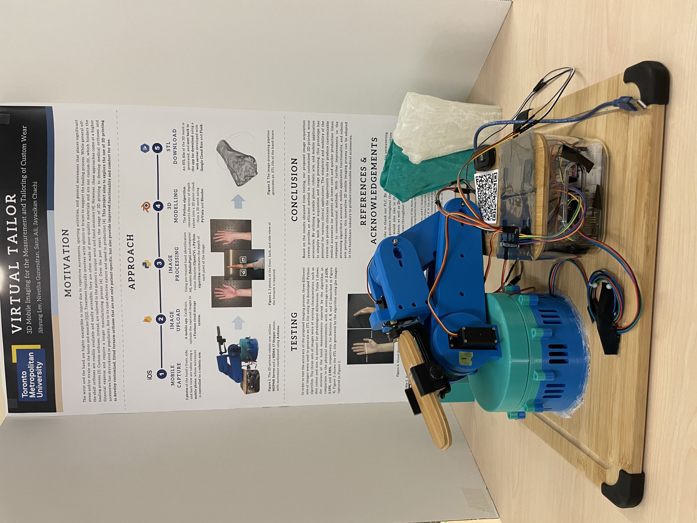
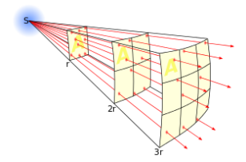
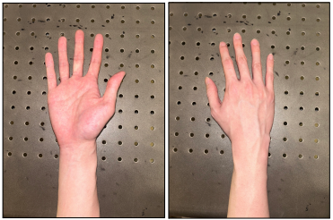
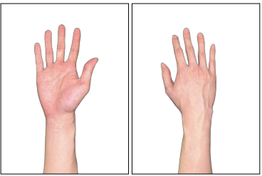
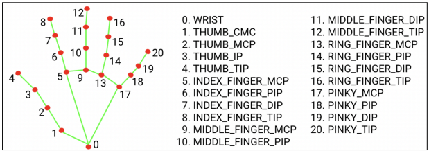
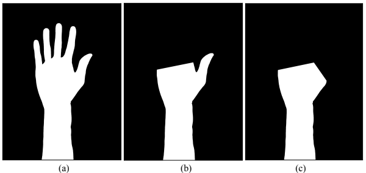
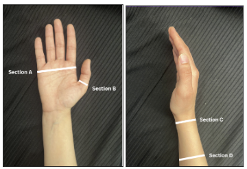
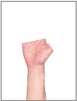
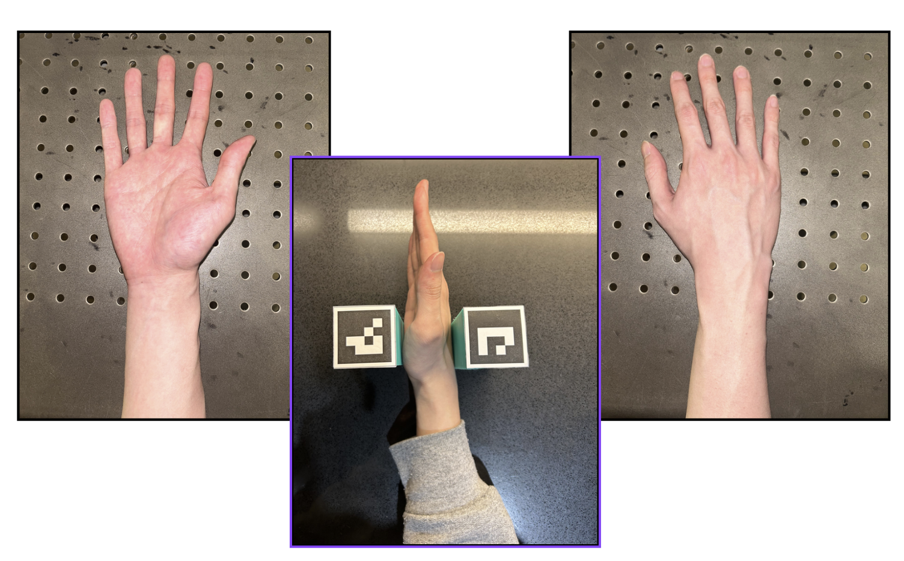

# Virtual-Tailor
This is the project repository for the **VY01 - Virtual Tailor Capstone Group** (Faculty of Engineering and Architectural Science, Toronto Metropolitan University). Dubbed as **"Calibrace"**, this project consists of an image-guided software algorithm that processes 3 distinct photos of a subject's hand into a 3D-printable, custom, and wearable wrist brace.

Languages/Tools used: `Python`, `React Native`, `OpenCV`, `Mediapipe`, `Flask`, `Docker`, `PyVista`  
Cloud Technologies: `Google Cloud Platform (GCP)`, `Cloud Run`, `Firebase`  
3D Modeling/CAD Technologies: `Blender`, `SolidWorks`, `Ultimaker Cura`, `MeshLab`

## Project Overview
Current commercial arm braces often follow a one-size fits all approach and customized arm braces can be expensive depending on the technology used to develop them. To allow for a simpler, cost-efficient, and mobile approach, our team developed the Virtual Tailor, which we refer to as CaliBrace. The imaging system consists of a 5-step process to develop an STL file that users can use to print a customized arm brace. A robotic arm is employed to take standardized pictures of the top and bottom view of the hand, and ArUco markers to determine the thickness of the brace. The images are then uploaded using a mobile app that run a web server function to process the images, develop a 3D model of the brace, and provide a download link for the STL file. Our team was successfully able to create 3D models from 3 different participants within an error of ± 1cm. Additionally, we were able to create a prototype of a customized brace worn by a team member on Engineering Day.

## Features
- A 3D printed robotic arm (lovingly named "Rodney") was assembled to automate and standardize the image acquisition process.
- Image-processing backend deployed to a Google Cloud Run server using Flask and Docker, enabling users to trigger the function and retrieve a custom brace in less than 3 minutes.
- Successfully able to create 3D models within an error of ± 1cm.

  

## Process
### Step 1. The Inverse Square Law
According to Jain et. al., an approach to depth estimation is to extract the intensity, or brightness value of each pixel in an image, as a function of distance from the sensor [1]. This approach is fundamentally derived from the inverse square law (Figure 1), which, according to the University of Calgary, is defined as when “the intensity of the property decreases in a particular way as the distance between interacting objects increases” [2, 3]. As illustrated below, this “intensity” can be attributed to the intensity of light.

  
   <strong>Figure 1.</strong> Inverse Square Law (Image courtesey of the University of Calgary).

### Step 2. Hand Capture/Segmentation
The mobile phone’s camera is positioned directly above the hand, and a photo is taken at 3 distinct views - the side, palmar, and dorsal views. Flash mode is activated when taking the image to ensure a light source forms directly above the target object. Figure 2 shows a sample image of the palmar and dorsal views of the hand, captured using an iOS phone with flash mode activated. After this step, the hands are segmented from the background. This is facilitated using Python’s `rembg` library, as shown in Figure 3.

  
   <strong>Figure 2.</strong> Palmar view (left) and dorsal view (right) of the hand.

  
   <strong>Figure 3.</strong> Palmar view (left) and dorsal view (right) of the hand, segmented using Python’s rembg library.

### Step 3. Masking
Now, the segmented images are further cropped to create a <em>mask</em> of the orthoses. First, key landmarks of the segmented hands are extracted using `Mediapipe`, Google’s
open-source suite of pre-trained machine learning (ML) models for hand classification. A diagram of the 21 landmarks identified by MediaPipe is shown in Figure 4 Specifically, the main landmarks of concern are #2, #5, and #17 – the landmarks for the metacarpophalangeal (MCP) joint, the MCP index finger joint, and the MCP pinky finger joint, respectively.

  
   <strong>Figure 4.</strong> Mediapipe’s indexes of each landmark of the hand (Image courtesy of Google).

Next, an outline of the segmented hand is generated using `OpenCV`’s contouring function. Specifically, `cv.findContours` yields an outline of the target object, as well as an array containing the coordinates of every pixel in the outline. As illustrated in Figure 5a, by setting the function’s thickness argument to `cv.FILLED`, a mask of the
segmented image can be obtained. However, the mask must be further cropped to resemble the shape of a wrist brace. In the initial cropping stage, the two individual pixels of the contour, which are closest to points #5 and #17 in MediaPipe’s landmark dictionary, are identified. Then, via simple indexing of the contour array, the mask is cropped such that Section A – the “upper” edges of the wrist brace that wrap around the circumference of the hand – can be estimated. The updated mask is shown in Figure 5b. Section A is further illustrated in Figure 6.

  
   <strong>Figure 5.</strong> (a) Un-cropped mask of the dorsal view of the hand. (b) 1st stage of the mask. (c) 2nd stage of the mask.

  
   <strong>Figure 6.</strong> Visual descriptions of Section A, Section B, Section C, and Section D.

Following this step, the mask must further be cropped such that Section B (Figure 6) is visible. This is implemented by taking the individual pixel of the contour closest to point #2 (metacarpophalangeal joint) in MediaPipe’s landmark dictionary. The same array-indexing process is performed to remove the finger from the mask, as shown in Figure 5c. The mask is then applied to the original segmented image using OpenCV’s `cv.bitwise_and boolean` operator. This step yields the masked image of the wrist brace, as shown in Figure 7.

  
   <strong>Figure 7.</strong> Masked image of the wrist brace.

## How to Run
Unfortunately, there is no current, feasiable way of hosting this project for free. The Cloud Run server and FireBase cloud storage used to host the back-end and image/STL files are closed. However, the process looks like the below:

1. Using the mobile app, the user takes a photo of the side-, back-, and front-view of the hand. 
2. The mobile app automatically uploads the images to a Firebase cloud database.
3. The mobile app generates a download URL, which the user can copy-paste to their browser.
4. The URL is similar in the format of `https://calibrace.a.run.app/?id={caseID}`. 
5. The Cloud Run server accepts this HTTPS request, and understands which images to process using the Case ID.
6. The Cloud Run server begins running the backend function, then triggers the user's web browser to download the completed STL file using a 302 status code.
 

  

## References
[1] R. Jain, R. Kasturi, and B. G. Schunck, “Depth,” in Machine Vision. McGraw-Hill, 1995, ch. 11, pp. 289-308. [PDF]. Available: https://cse.usf.edu/~r1k/MachineVisionBook/MachineVision.files/MachineVision_Chapter11.pdf  
[2] “More on Brightness as a Function of Distance.” NASA. https://imagine.gsfc.nasa.gov/features/yba/M31_velocity/lightcurve/more.html  
[3] “Inverse square law.” Energy Education, University of Calgary. https://energyeducation.ca/encyclopedia/Inverse_square_law  

